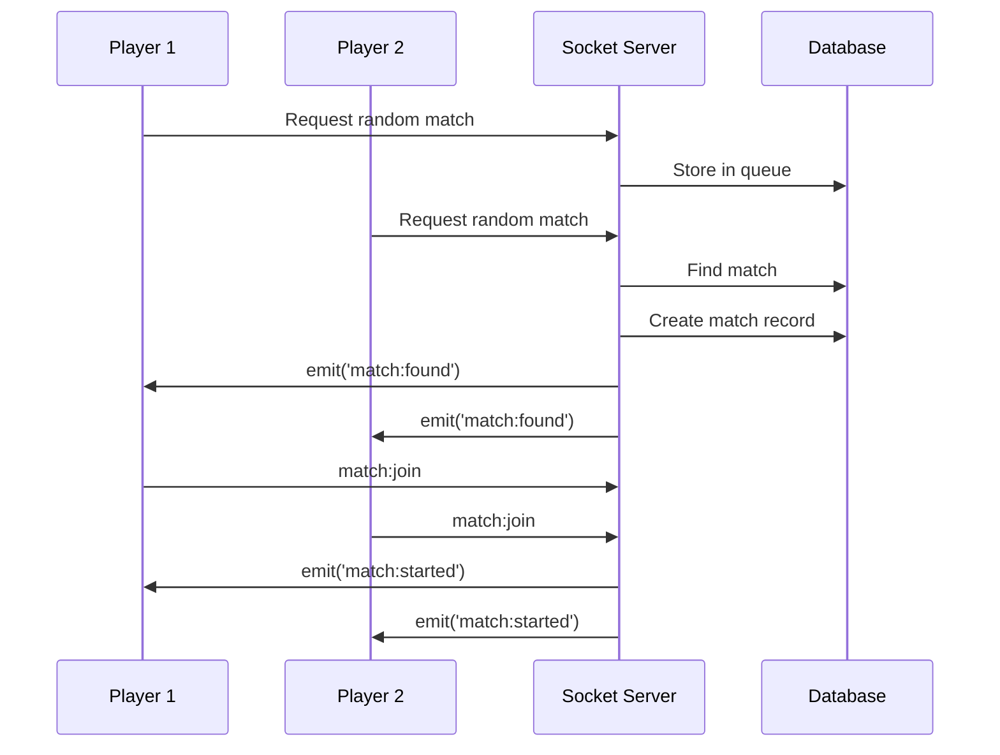
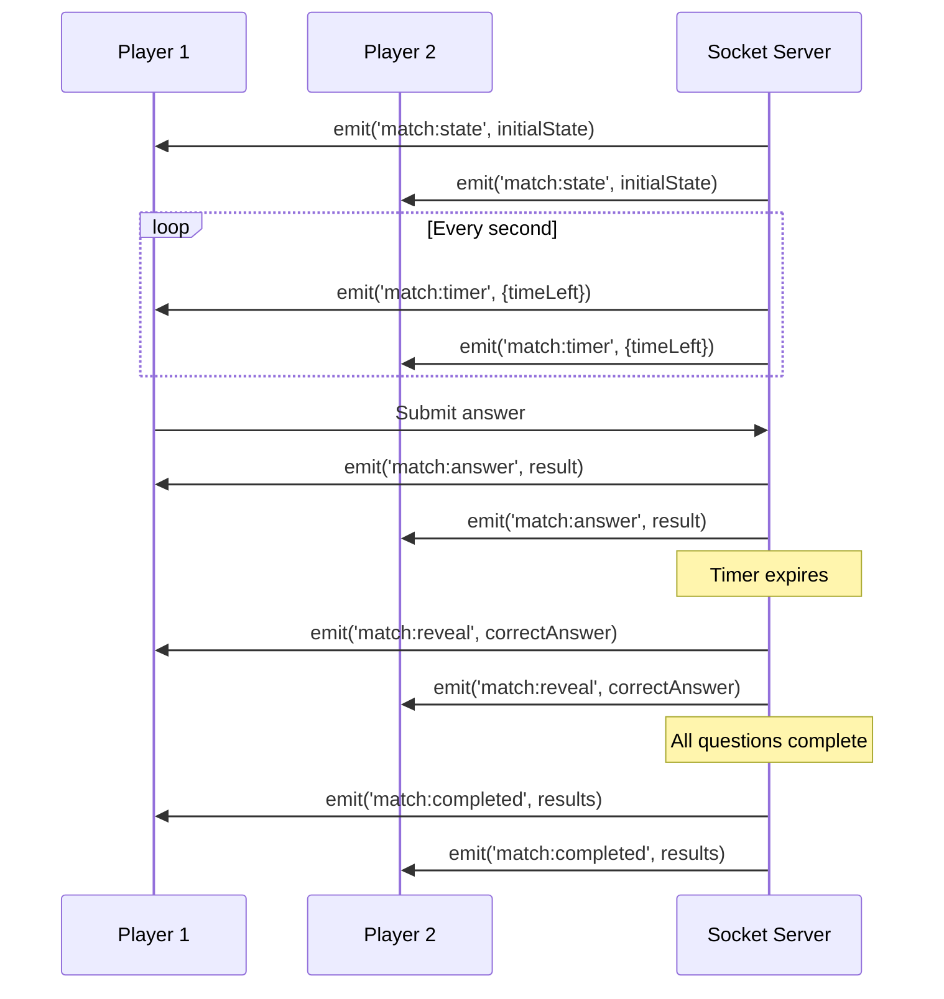

# Socket.IO System Documentation - Code Clash Real-Time Battle System

## Overview

The Code Clash application uses Socket.IO to enable real-time communication between players during coding battles. This documentation explains how the socket system works, the event flows, and the architecture that powers the real-time battle experience.

## Table of Contents

1. [Architecture Overview](#architecture-overview)
2. [Backend Socket Implementation](#backend-socket-implementation)
3. [Frontend Socket Integration](#frontend-socket-integration)
4. [Socket Events Reference](#socket-events-reference)
5. [Event Flow Diagrams](#event-flow-diagrams)
6. [Authentication & Security](#authentication--security)
7. [Room Management](#room-management)
8. [Match Timer System](#match-timer-system)
9. [Error Handling](#error-handling)
10. [Debugging Guide](#debugging-guide)

---

## Architecture Overview

### System Components

```
┌─────────────────┐    WebSocket     ┌─────────────────┐
│   Frontend      │ ◄──────────────► │   Backend       │
│   (React/Next)  │                  │   (Node.js)     │
├─────────────────┤                  ├─────────────────┤
│ • Socket Client │                  │ • Socket Server │
│ • Event Handlers│                  │ • Room Manager  │
│ • State Sync    │                  │ • Match Timers  │
│ • UI Updates    │                  │ • Event Handlers│
└─────────────────┘                  └─────────────────┘
```

### Key Technologies
- **Socket.IO**: WebSocket library for real-time communication
- **Redis**: Session storage and scalability (if configured)
- **JWT**: Authentication tokens for socket connections
- **Prisma**: Database integration for match state

---

## Backend Socket Implementation

### Server Setup (`backend/src/sockets/io.js`)

The backend socket server is the central hub that manages all real-time communications:

```javascript
// Core Socket.IO server instance
let io;

const initializeSocket = (httpServer) => {
  io = new Server(httpServer, {
    cors: {
      origin: process.env.FRONTEND_URL || "http://localhost:3000",
      methods: ["GET", "POST"],
      credentials: true,
    },
    path: "/api/socket.io",
  });
  
  // Authentication middleware
  io.use(authenticateSocket);
  
  // Connection handler
  io.on('connection', handleConnection);
};
```

### Authentication Middleware

Every socket connection is authenticated using JWT tokens:

```javascript
const authenticateSocket = async (socket, next) => {
  try {
    const token = socket.handshake.auth.token;
    const decoded = jwt.verify(token, process.env.JWT_SECRET);
    
    // Attach user info to socket
    socket.userId = decoded.userId;
    socket.user = decoded;
    
    next();
  } catch (error) {
    next(new Error('Authentication failed'));
  }
};
```

### Connection Handler

When a user connects, they're automatically joined to their user room:

```javascript
const handleConnection = (socket) => {
  const { userId } = socket;
  
  // Join user-specific room for direct messaging
  socket.join(userId);
  
  // Set up event listeners
  setupEventListeners(socket);
  
  socket.on('disconnect', () => handleDisconnect(socket));
};
```

### Event Listeners

The backend listens for various events from clients:

```javascript
const setupEventListeners = (socket) => {
  // Match-related events
  socket.on('match:join', handleMatchJoin);
  socket.on('match:leave', handleMatchLeave);
  socket.on('match:submit', handleMatchSubmit);
  
  // User-related events
  socket.on('user:join', handleUserJoin);
};
```

---

## Frontend Socket Integration

### Socket Client Setup (`frontend/src/lib/socket.ts`)

The frontend creates a socket connection that can be shared across components:

```typescript
import { io, Socket } from 'socket.io-client';

const socket: Socket = io(process.env.NEXT_PUBLIC_BACKEND_URL || 'http://localhost:3001', {
  autoConnect: false,
  path: "/api/socket.io"
});

export default socket;
```

### Authentication Integration

The socket is authenticated using the user's JWT token:

```typescript
// In apiUtils.ts
export const authenticateSocket = (token: string) => {
  socket.auth = { token };
  
  if (socket.connected) {
    socket.disconnect();
    socket.connect();
  }
};
```

### React Component Integration

Components use socket events to synchronize state:

```typescript
// Example from battle waiting room
useEffect(() => {
  const handleMatchFound = (data) => {
    setMatchData(data);
    router.push(`/battle/play/${data.matchId}`);
  };

  socket.on('match:found', handleMatchFound);
  
  return () => {
    socket.off('match:found', handleMatchFound);
  };
}, []);
```

---

## Socket Events Reference

### Match Events

#### `match:found`
**Direction**: Server → Client  
**Purpose**: Notifies players when a match is found  
**Payload**:
```typescript
{
  matchId: string;
  opponent: {
    id: string;
    username: string;
    avatar?: string;
  };
}
```

#### `match:started`
**Direction**: Server → Client  
**Purpose**: Signals that a match has officially begun  
**Payload**:
```typescript
{
  matchId: string;
}
```

#### `match:join`
**Direction**: Client → Server  
**Purpose**: Player joins a specific match room  
**Payload**:
```typescript
{
  matchId: string;
}
```

#### `match:leave`
**Direction**: Client → Server  
**Purpose**: Player leaves a match room  
**Payload**:
```typescript
{
  matchId: string;
}
```

#### `match:state`
**Direction**: Server → Client  
**Purpose**: Synchronizes match state between players  
**Payload**:
```typescript
{
  currentQuestion: number;
  timeLeft: number;
  answers: Record<string, any>;
  status: 'waiting' | 'active' | 'completed';
}
```

#### `match:timer`
**Direction**: Server → Client  
**Purpose**: Real-time timer updates  
**Payload**:
```typescript
{
  timeLeft: number;
}
```

#### `match:answer`
**Direction**: Server → Client  
**Purpose**: Notifies when a player submits an answer  
**Payload**:
```typescript
{
  userId: string;
  questionIndex: number;
  isCorrect: boolean;
  timeRemaining: number;
}
```

#### `match:reveal`
**Direction**: Server → Client  
**Purpose**: Shows correct answers after time expires  
**Payload**:
```typescript
{
  questionIndex: number;
  correctAnswer: string;
  explanations?: string[];
}
```

#### `match:completed`
**Direction**: Server → Client  
**Purpose**: Indicates match has ended  
**Payload**:
```typescript
{
  winner: string | null;
  scores: {
    [userId: string]: number;
  };
  redirect: string;
}
```

### User Events

#### `user:join`
**Direction**: Client → Server  
**Purpose**: Associates user with their socket connection  
**Payload**:
```typescript
{
  userId: string;
}
```

---

## Event Flow Diagrams

### Match Finding Flow



### Battle Flow



---

## Authentication & Security

### Token-Based Authentication

1. **Frontend obtains JWT** from authentication service
2. **Socket connection** includes token in handshake
3. **Server validates** token and extracts user info
4. **User context** attached to socket for authorization

### Security Measures

- **CORS configuration** restricts origins
- **JWT validation** on every connection
- **Room-based authorization** ensures users can only join their matches
- **Rate limiting** prevents spam (implemented via middleware)

---

## Room Management

### Room Types

#### User Rooms
- **Format**: `userId` (e.g., "user123")
- **Purpose**: Direct messaging to specific users
- **Usage**: Match notifications, friend requests

#### Match Rooms  
- **Format**: `matchId` (e.g., "match456")
- **Purpose**: Match-specific communication
- **Usage**: Real-time battle events, timer sync

### Room Operations

```javascript
// Join operations
socket.join(userId);           // User room
socket.join(matchId);          // Match room

// Emit to rooms
io.to(userId).emit('event');   // Direct to user
io.to(matchId).emit('event');  // Broadcast to match

// Leave operations
socket.leave(matchId);         // Clean exit
```

---

## Match Timer System

### Timer Architecture

The backend maintains authoritative timers for each match:

```javascript
// Timer storage
const matchTimers = new Map();

const startMatchTimer = (matchId, duration) => {
  const timer = {
    matchId,
    timeLeft: duration,
    startTime: Date.now(),
    interval: null
  };
  
  timer.interval = setInterval(() => {
    timer.timeLeft -= 1;
    
    // Broadcast timer update
    io.to(matchId).emit('match:timer', { 
      timeLeft: timer.timeLeft 
    });
    
    if (timer.timeLeft <= 0) {
      handleTimerExpired(matchId);
    }
  }, 1000);
  
  matchTimers.set(matchId, timer);
};
```

### Timer Synchronization

- **Server-authoritative**: Backend controls all timing
- **Regular broadcasts**: Timer updates sent every second
- **Automatic cleanup**: Timers cleared when matches end
- **Resilient**: Continues even if players disconnect

---

## Error Handling

### Connection Errors

```typescript
socket.on('connect_error', (error) => {
  console.error('Socket connection failed:', error);
  // Retry logic or fallback UI
});
```

### Authentication Failures

```javascript
socket.on('disconnect', (reason) => {
  if (reason === 'io server disconnect') {
    // Server forcefully disconnected (auth failure)
    redirectToLogin();
  }
});
```

### Event Error Handling

```typescript
socket.on('error', (error) => {
  console.error('Socket error:', error);
  showErrorMessage('Connection issue. Retrying...');
});
```

---

## Debugging Guide

### Backend Debugging

1. **Check server logs** for connection events
2. **Monitor room membership** using `io.sockets.adapter.rooms`
3. **Verify JWT tokens** in authentication middleware
4. **Track timer states** in match timer system

### Frontend Debugging

1. **Check socket connection status**: `socket.connected`
2. **Monitor event listeners**: Ensure proper cleanup
3. **Verify authentication**: Check token in auth header
4. **Debug event payloads**: Log incoming events

### Common Issues

#### Socket Not Connecting
- Verify backend URL and port
- Check CORS configuration
- Validate JWT token format

#### Events Not Received
- Confirm socket is connected
- Check event listener spelling
- Verify room membership

#### Timer Desync
- Backend timer is authoritative
- Check network latency
- Verify timer cleanup on disconnect

### Debug Commands

```javascript
// Check connection status
console.log('Connected:', socket.connected);

// View current rooms
console.log('Rooms:', socket.rooms);

// Monitor all events
socket.onAny((event, ...args) => {
  console.log('Event:', event, args);
});
```

---

## Best Practices

### Performance
- **Efficient event listeners**: Remove unused listeners
- **Batched updates**: Group related events
- **Memory management**: Clean up timers and intervals

### Reliability  
- **Reconnection logic**: Handle dropped connections
- **State synchronization**: Restore state on reconnect
- **Graceful degradation**: Fallback for socket failures

### Scalability
- **Room-based messaging**: Avoid broadcasting to all users
- **Redis adapter**: Scale across multiple servers
- **Rate limiting**: Prevent abuse and spam

---

## Conclusion

The Socket.IO system in Code Clash enables seamless real-time battles by:

1. **Maintaining persistent connections** between players and server
2. **Synchronizing match state** across all participants  
3. **Providing real-time timer updates** for competitive gameplay
4. **Handling authentication and security** for trusted connections
5. **Managing complex event flows** for smooth user experience

Understanding this architecture helps in debugging issues, adding new features, and maintaining the real-time battle system that makes Code Clash engaging and competitive.
